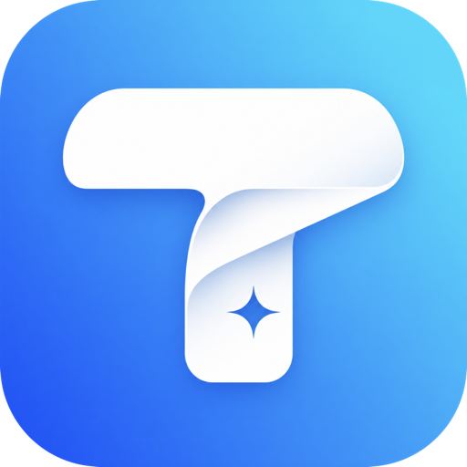
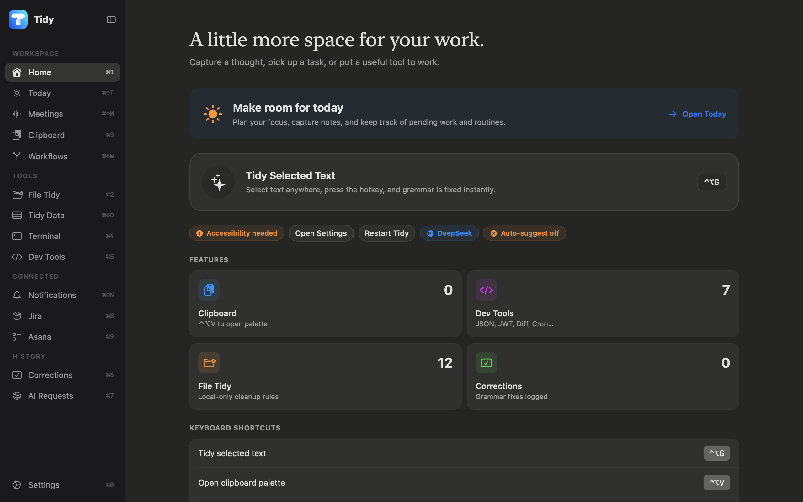

<p align="center">
  
</p>

<h1 align="center">Tidy</h1>

<p align="center">
  The productivity layer your Mac deserves — AI-powered, keyboard-first, clutter-free.
</p>

<p align="center">
  
</p>

## Features

- **Grammar fix** — select text in any app, press `⌃⌥G`, Tidy rewrites it via your chosen AI provider.
- **Ask AI** — press `⌃⌥J` for a Quick AI chat panel with source slots for MCP, llm-wiki, and local folder context.
- **Unified notifications** — connect a remote MCP server and summarize Slack, Gmail, and Google Calendar in one inbox.
- **Clipboard history** — automatic history with search, hover-copy, and a quick-access palette (`⌃⌥V`).
- **File Tidy** — local folder scanning with preview-first move proposals, duplicate/stale/build-artifact detection, selective approval, and undo logs.
- **Jira workspace** — browse and multi-filter active-sprint tickets, understand status/priority/assignee changes from the notification center and menu bar, and read, post, or edit comments without leaving Tidy.
- **Asana My Tasks** — connect a workspace, search and filter assigned tasks by due date, mark work complete, and jump to the original task in Asana.
- **Developer tools** — JSON formatter/validator, JWT decoder, text diff, Unix time converter, CSV ↔ JSON converter, cron parser.
- **Light / Dark / System** appearance, user-selectable from Settings.
- **Multiple AI providers** — Gemini Flash, OpenAI, Anthropic, DeepSeek, Ollama (local), OpenCode, LanguageTool.
- API keys stored securely in macOS Keychain.

## Requirements

- macOS 15.3 or newer.
- Xcode 16 or newer.
- Accessibility permission for reading and replacing selected text.
- Network access for cloud grammar providers. Ollama and LanguageTool can be used locally depending on your configuration.

## Getting started

### 1. Clone

```sh
git clone https://github.com/jancuk/tidy.git
cd Tidy
```

### 2. Set your Team ID

Create a `Local.xcconfig` file in the repo root (it is gitignored):

```
DEVELOPMENT_TEAM = YOUR_TEAM_ID
```

Find your Team ID at [developer.apple.com/account](https://developer.apple.com/account) → Membership Details.  
If you just want to run it without code signing, leave it blank — Xcode will prompt you to choose a team on first build.

### 3. Build and run

Open `Tidy.xcodeproj` in Xcode, select the **Tidy** scheme with **My Mac** as destination, and press `⌘R`.

From the command line:

```sh
xcodebuild -project Tidy.xcodeproj -scheme Tidy -destination 'platform=macOS' build
```

Run unit tests:

```sh
xcodebuild test -project Tidy.xcodeproj -scheme Tidy -destination 'platform=macOS' -only-testing:TidyTests
```

### 4. Add an API key

Open Settings (gear icon in the sidebar) → **Grammar** tab → paste your API key and click **Save API Keys**.

| Provider | Where to get a key |
|---|---|
| Gemini Flash | [aistudio.google.com](https://aistudio.google.com) — free tier available |
| OpenAI | [platform.openai.com](https://platform.openai.com) |
| Anthropic | [console.anthropic.com](https://console.anthropic.com) |
| DeepSeek | [platform.deepseek.com](https://platform.deepseek.com) |
| Ollama | No key needed — runs locally |

Gemini also checks the `GEMINI_API_KEY` environment variable before falling back to the saved Keychain value.

### 5. Grant Accessibility permission

Tidy needs Accessibility access to read selected text and paste the corrected version back. macOS will prompt on first use, or go to **System Settings → Privacy & Security → Accessibility**.

### 6. Connect Jira Cloud

Open **Settings → Jira**, enter your `https://company.atlassian.net` site URL, Atlassian account email, and an API token, then click **Test Connection**. Open **Jira** from the sidebar, enter a project key, and choose **Use Me** to filter the active sprint to your assigned tickets.

The Jira API token is stored in macOS Keychain. Tidy uses Jira Cloud's REST API directly and does not persist ticket content locally.

### 7. Connect Asana

Create an OAuth API app in the Asana developer console, mark it as a native or command-line app, add the redirect URI `urn:ietf:wg:oauth:2.0:oob`, and register these permission scopes: `tasks:read`, `tasks:write`, and `workspaces:read`. Open **Settings → Asana**, enter the app's **Client ID** and **Client Secret**, then click **Connect with Asana**. Approve access in the browser, paste the authorization code into Tidy, and complete the connection. Choose a workspace and open **Asana** from the sidebar to load your assigned, incomplete tasks.

The app credentials, access token, and refresh token are stored in macOS Keychain. Tidy talks directly to Asana's official API, refreshes expired access tokens automatically, and keeps task content in memory only for the current app session.

### 8. Connect an MCP server

Open **Settings → MCP** and enter:

- the Streamable HTTP endpoint, for example `https://mcp.example.com/api`;
- the API-key header name, for example `x-api-key`;
- the API key.

Click **Test & Discover Tools**. Tidy performs the MCP initialization handshake, discovers the server's tools, and shows the read-only tool mapped to Slack, Gmail, Google Calendar, New Relic, and Jira. Open **Notifications** in the sidebar and click **Refresh** to create the combined Slack, Gmail, and Calendar summaries.

The API key is stored in macOS Keychain. Remote endpoints must use HTTPS (plain HTTP is allowed only for localhost). Tidy automatically refuses tools that look mutating, and automatic refresh remains off until you enable it.

## Roadmap

Tidy's long-term direction is a personal Mac assistant for cleaning up text, files, and daily developer context.

### File Tidy

Help developers clean messy folders like `Downloads` and `Desktop` with a safe, preview-first workflow.

- Scan a selected folder locally from the File Tidy sidebar item.
- Group files by type, date, project hint, and usage pattern.
- Propose moves such as screenshots to `Pictures/Screenshots`, installers to `Downloads/Installers`, archives to `Archives`, and documents to useful folders.
- Detect duplicate files, large stale files, build artifacts, old logs, and temporary exports.
- Show every proposed move before anything changes.
- Let the user approve selected changes.
- Keep an undo log for moved or renamed files.

The first version is rule-based and local-only. AI suggestions can come later for naming, folder recommendations, and explanations.

### Developer Desk Cleanup

Add developer-aware cleanup checks:

- Find old `node_modules`, `.next`, `dist`, `build`, `.turbo`, `coverage`, `DerivedData`, `.xcarchive`, `.profraw`, and log folders.
- Detect abandoned project folders and warn when a Git repo has uncommitted changes.
- Separate "safe to delete", "archive first", and "needs review" recommendations.
- Surface disk usage by project and generated artifact type.

### Work Assistant

Summarize daily work context across tools, with explicit user permission for each integration.

- Slack summary: unread mentions, decisions, blockers, and threads needing replies.
- Jira summary: assigned issues, stale tickets, due dates, blocked work, and recent changes.
- Asana summary: assigned tasks, overdue work, upcoming due dates, and unplanned tasks.
- Pending work summary: combine reminders, open tasks, recent clipboard/context, and user-selected sources into a daily brief.
- Meeting prep: summarize related issues, recent messages, and files before a calendar event.
- End-of-day wrap: list completed work, unresolved questions, and suggested next actions.

These integrations should be opt-in, transparent about what data is read, and avoid storing third-party content unless the user explicitly enables local history.

## Privacy And Security

- API keys are stored in macOS Keychain, not in `UserDefaults` or project files.
- Jira ticket data is fetched on demand and is not persisted locally.
- Asana task data is fetched on demand and is not persisted locally.
- Raw MCP tool responses are kept in memory only. Notification summaries are cached locally so the unified inbox survives a restart.
- Notification summarization sends a bounded portion of MCP tool output to the configured AI provider; select Ollama if that processing must stay local.
- Clipboard history is stored locally.
- Clipboard capture skips common password managers and transient pasteboard content.
- Selected text is sent only to the grammar provider you configure. Cloud providers receive the selected text for grammar correction.
- The app requests Accessibility permission so it can read selected text and paste the corrected result.
- The repository intentionally ignores local assistant worktrees, Xcode user state, profiling files, app databases, and `.env` files.

Before publishing a fork, run a local secret scan and review `git status --ignored` to make sure local state is not staged.

## Repository Hygiene

Do not commit:

- `.claude/` or other local assistant worktrees.
- `xcuserdata/` or `*.xcuserstate`.
- `.env` files or API keys.
- Private keys, signing certificates, and provisioning profiles.
- Local SQLite databases or profiling output.

## License

MIT — see [LICENSE](LICENSE).
